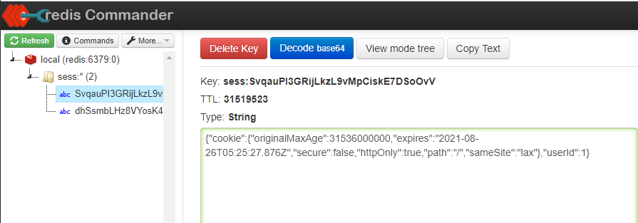
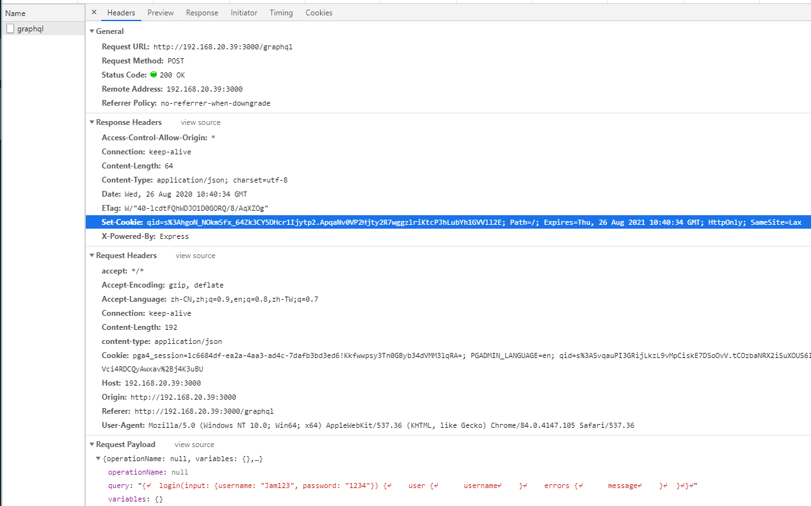
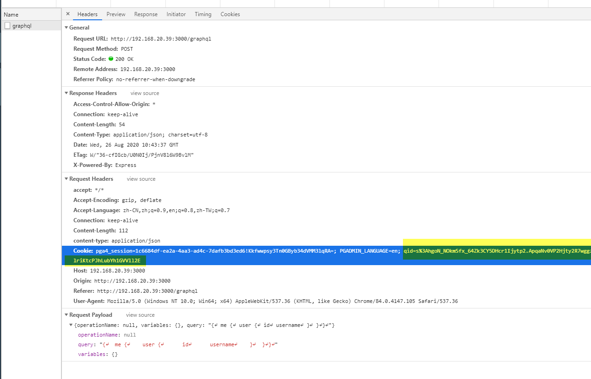

To make the user stays logged in, we stores a cookie in user's browser, and use session to keep users' information.

The session will be saved on server-side, in this example we save user's data in redis server.

Step 1: Install

```
yarn add redis connect-redis express-session
yarn add -D @types/redis @types/connect-redis @types/express-session
```

Step 2: Connect `express-session` to `redis`

./src/index.ts

```ts
// redis
import redis from "redis";
import session from "express-session";
import connectRedis from "connect-redis";

const app = express();

const RedisStore = connectRedis(session);
const redisClient = redis.createClient(6379, "192.168.20.39"); // don't put http://192.168.20.39

// session middleware has to run before apollo middleware
// 'secret' will be used to sign your cookie
// 'disableTouch' is to disable re-saving and reseting the TTL
app.use(
  session({
    name: "qid", // any meaningful name
    store: new RedisStore({
      client: redisClient,
      disableTouch: true,
    }),
    cookie: {
      maxAge: 1000 * 60 * 60 * 24 * 365, // one year
      httpOnly: true,
      sameSite: "lax",
      secure: __prod__,
    },
    saveUninitialized: false, // don't init if nothing saved in session
    secret: "your_cookie_secret_here", // used to sign the session ID cookie, Using a secret that cannot be guessed will reduce the ability to hijack a session to only guessing the session ID
    resave: false,
  })
);
```

Now redis is connected to express app, once session is created, you can see something from redis



Step 3: Inject `req` and `res` into apollo `context` object, later you can retreive `session` from `req.session`

./src/index.ts

```ts
const apolloServer = new ApolloServer({
  schema,
  context: ({ req, res }) => ({ em: orm.em, req, res }),
});
```

Step 4: Read/Write to session object from `User` resolver

./src/resolvers/user.ts

Write user.id to session, when user login

```ts
  @Query(() => UserResponse)
  async login(
    @Arg("input") input: UsernamePasswordInput,
    @Ctx() { em, req }: MyContext
  ): Promise<UserResponse> {
    const { username, password } = input;
    if (!username || !password)
      return {
        user: undefined,
        errors: [
          {
            field: "usernameOrPassword",
            message: "username/password is requried",
          },
        ],
      };
    const userInDb = await em.findOne(User, { username });
    if (!userInDb)
      return {
        errors: [
          { field: "usernameOrPassword", message: "invalid username/password" },
        ],
      };

    const isPasswordValid = await argon2.verify(userInDb.password, password);

    if (!isPasswordValid)
      return {
        errors: [
          { field: "usernameOrPassword", message: "invalid username/password" },
        ],
      };

    req.session.userId = userInDb.id;

    return {
      user: userInDb,
    };
  }
```

Note:
`req.session.userId = userInDb.id` because by default could be undefind, in our custom type `MyContext`, we can override that by

./src/types.ts

```ts
import { EntityManager, IDatabaseDriver, Connection } from "@mikro-orm/core";
import {Request, Response, Express } from 'express'

export type MyContext {
  em: EntityManager<any> & EntityManager<IDatabaseDriver<Connection>>;
  req: Request & { session: Express.Session };
  res: Response;
}
```

`Request & { session: Express.Session }` means the joint of `Request` and `{ session: Express.Session }`, which override the `{ session?: Express.Session | undefined }` from `Request`. By using `Request & { session: Express.Session }`, we force `req.session` to be non-nullable

Step 5: create a util resolver function `me`, which read `session.userId` from `req.sesson`, and returns the logged-in user, or `undefined` if `session.id` is not found

./src/types.ts

```ts
   @Query(() => UserResponse)
  async me(@Ctx() { em, req }: MyContext): Promise<UserResponse> {
    if (!req.session.userId)
      return {
        user: undefined,
      };
    const userInDb = await em.findOne(User, { id: req.session.userId });
    if (!userInDb)
      return {
        user: undefined,
      };

    return {
      user: userInDb,
    };
  }
```

Now when you log in at the first time, from the response header you will see `set-cookie` directive, which will instruct the user's browser to create a cookie



Later on in every user's request from browser, you can see the cookie from user's request


